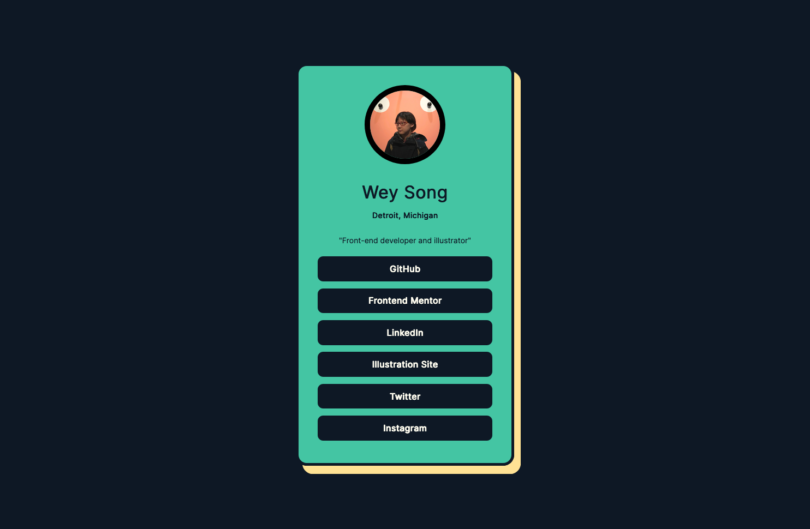
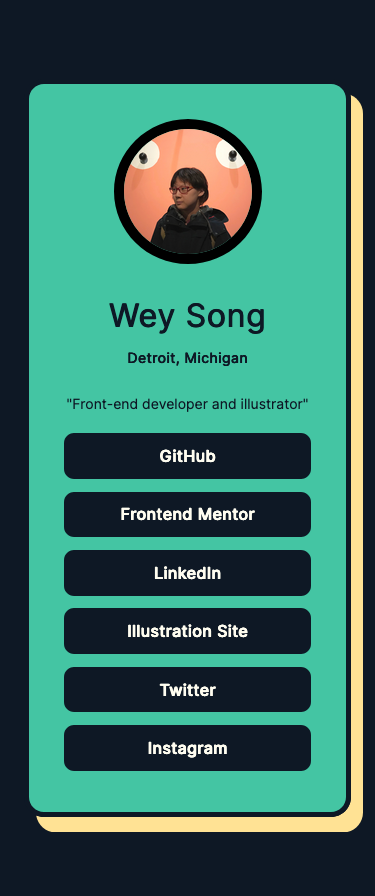

# Frontend Mentor - Social links profile solution

This is a solution to the [Social links profile challenge on Frontend Mentor](https://www.frontendmentor.io/challenges/social-links-profile-UG32l9m6dQ). Frontend Mentor challenges help you improve your coding skills by building realistic projects.

## Table of contents

- [Overview](#overview)
  - [The challenge](#the-challenge)
  - [Screenshot](#screenshot)
  - [Links](#links)
- [My process](#my-process)
  - [Built with](#built-with)
  - [Continued development](#continued-development)
  - [Useful resources](#useful-resources)

## Overview

### The challenge

Users should be able to:

- See hover and focus states for all interactive elements on the page

### Screenshot

### Links

- Solution URL: [Link](https://www.frontendmentor.io/solutions/social-links-profile-uD5uymJ7GZ)
- Live Site URL: [Link](https://social-links-profile-green-nine.vercel.app/)

## My process

### Built with

- Semantic HTML5 markup
- CSS custom properties
- Flexbox
- Mobile-first workflow

### Continued development

In the future I would like to experiment with more animations when hovering. I hope to be able to add more of this interactivity!

### Useful resources

- [CSS Buttons With Awesome Hover Animation Using HTML & CSS by DarkCode](https://www.youtube.com/watch?v=CMgl_etzlTI) - This helped me figure out the animation I used. I really liked figuring out how to get it to work for me.
